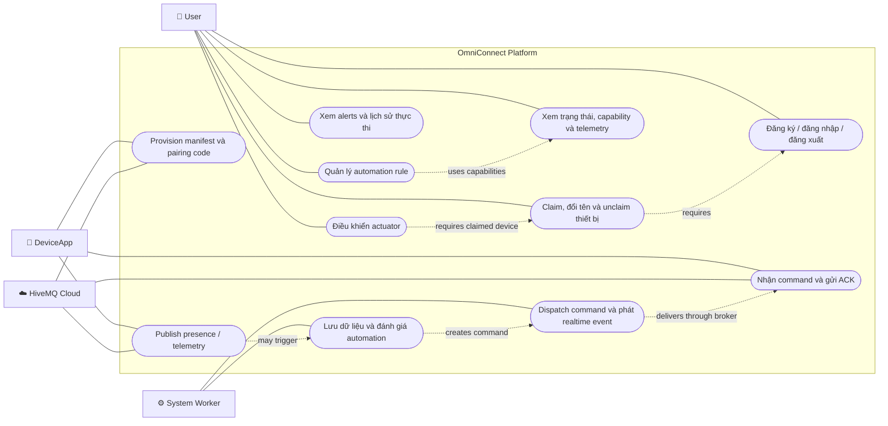
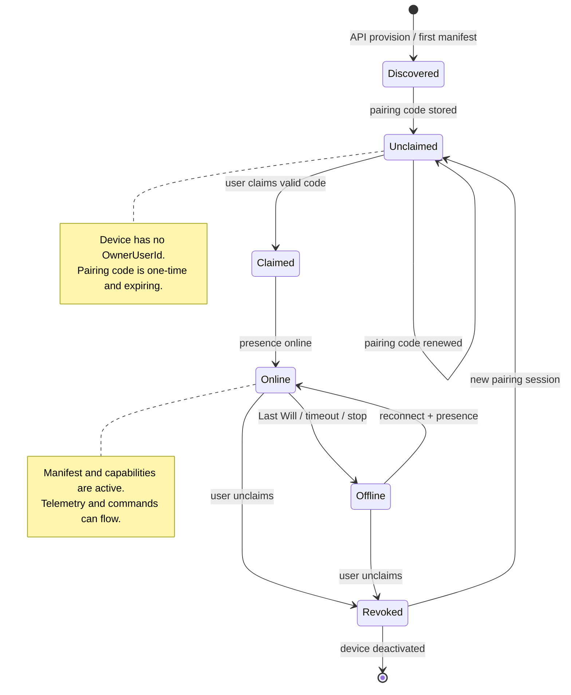
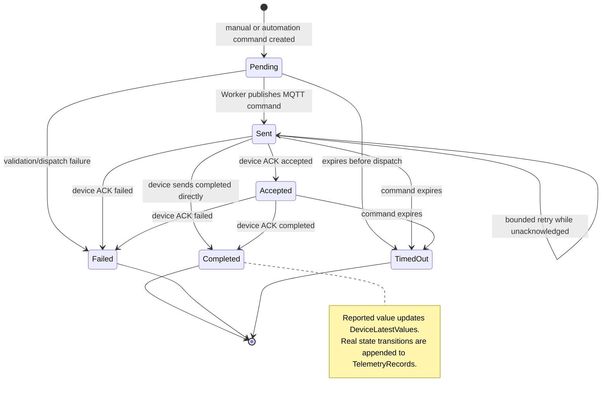

# Use case and state diagrams

## Use case diagram

```mermaid
flowchart LR
    User["👤 User"]
    Device["🔌 DeviceApp"]
    Worker["⚙️ System Worker"]
    Broker["☁️ HiveMQ Cloud"]

    subgraph System["OmniConnect Platform"]
        UC1(["Đăng ký / đăng nhập / đăng xuất"])
        UC2(["Claim, đổi tên và unclaim thiết bị"])
        UC3(["Xem trạng thái, capability và telemetry"])
        UC4(["Điều khiển actuator"])
        UC5(["Quản lý automation rule"])
        UC6(["Xem alerts và lịch sử thực thi"])
        UC7(["Provision manifest và pairing code"])
        UC8(["Publish presence / telemetry"])
        UC9(["Nhận command và gửi ACK"])
        UC10(["Lưu dữ liệu và đánh giá automation"])
        UC11(["Dispatch command và phát realtime event"])
    end

    User --- UC1
    User --- UC2
    User --- UC3
    User --- UC4
    User --- UC5
    User --- UC6

    Device --- UC7
    Device --- UC8
    Device --- UC9
    Broker --- UC7
    Broker --- UC8
    Broker --- UC9
    Worker --- UC10
    Worker --- UC11

    UC2 -. "requires" .-> UC1
    UC4 -. "requires claimed device" .-> UC2
    UC5 -. "uses capabilities" .-> UC3
    UC8 -. "may trigger" .-> UC10
    UC10 -. "creates command" .-> UC11
    UC11 -. "delivers through broker" .-> UC9
```

## Device lifecycle state diagram

```mermaid
stateDiagram-v2
    [*] --> Discovered: API provision / first manifest
    Discovered --> Unclaimed: pairing code stored
    Unclaimed --> Claimed: user claims valid code
    Unclaimed --> Unclaimed: pairing code renewed
    Claimed --> Online: presence online
    Online --> Offline: Last Will / timeout / stop
    Offline --> Online: reconnect + presence
    Online --> Revoked: user unclaims
    Offline --> Revoked: user unclaims
    Revoked --> Unclaimed: new pairing session
    Revoked --> [*]: device deactivated

    note right of Unclaimed
        Device has no OwnerUserId.
        Pairing code is one-time and expiring.
    end note

    note right of Online
        Manifest and capabilities are active.
        Telemetry and commands can flow.
    end note
```

## Command lifecycle state diagram

```mermaid
stateDiagram-v2
    [*] --> Pending: manual or automation command created
    Pending --> Sent: Worker publishes MQTT command
    Pending --> TimedOut: expires before dispatch
    Sent --> Sent: bounded retry while unacknowledged
    Sent --> Accepted: device ACK accepted
    Sent --> Completed: device sends completed directly
    Accepted --> Completed: device ACK completed
    Pending --> Failed: validation/dispatch failure
    Sent --> Failed: device ACK failed
    Accepted --> Failed: device ACK failed
    Sent --> TimedOut: command expires
    Accepted --> TimedOut: command expires
    Completed --> [*]
    Failed --> [*]
    TimedOut --> [*]

    note right of Completed
        Reported value updates DeviceLatestValues.
        Real state transitions are appended to TelemetryRecords.
    end note
```

